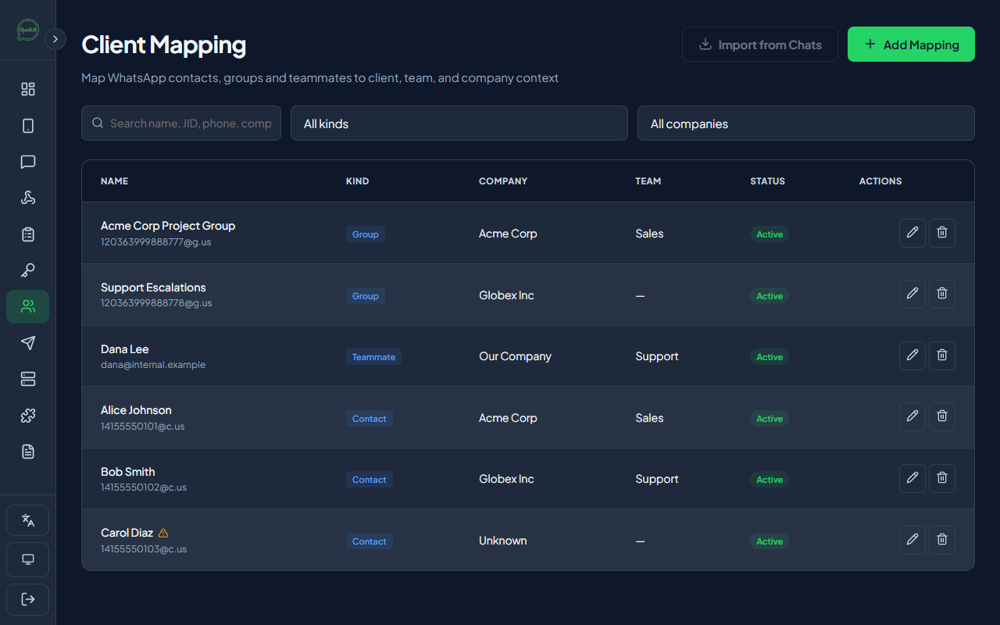
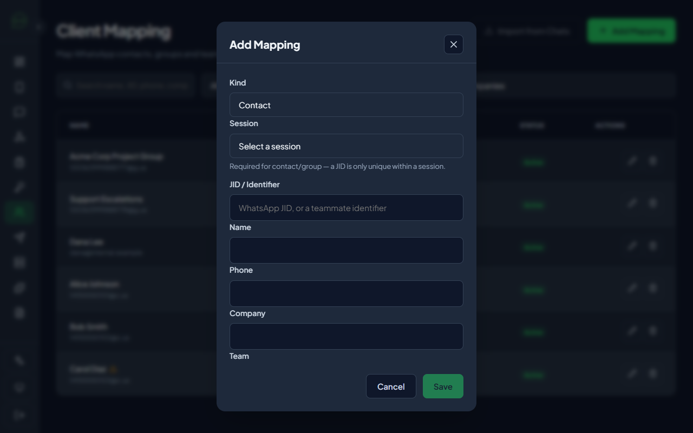

# 32 - Client Mapping

> **Status:** Shipped. `client_mappings` table + full CRUD API + admin dashboard page, plus
> automatic tagging and a bulk import from existing chats. See [06 - API
> Specification](./06-api-specification.md#6418-clientteammategroup-mapping) for the full REST
> contract.

## 32.1 What it is

Anyone running OpenWA across more than one client, team, or project — an agency, a community
manager juggling several groups, a support desk split by account — eventually needs to answer "who
is this WhatsApp contact/group, and which client/team do they belong to?" **Client Mapping** is a
lightweight directory that tags a WhatsApp contact JID, a group JID, or an internal teammate
identifier with organizational metadata: company, team, role, time zone, a backup/secondary
contact, and free-text notes.

It is deliberately _just_ a directory — a labeled lookup table, not a CRM. It does not send
messages, does not gate anything else in OpenWA, and every feature that reads it (a scheduled
export, a downstream automation, a reporting dashboard) is left for whoever builds on top of the
API and the `ClientMapping` entity.

## 32.2 Data model

Each row has a `kind`: `contact`, `group`, or `teammate`.

- **`contact`** and **`group`** rows are scoped to a WhatsApp session (`sessionId` + `jid` + `kind`
  is unique) — a jid is only meaningful within the session that resolved it.
- **`teammate`** rows have no WhatsApp session at all (an internal person identifier, e.g. an email
  or username) — `sessionId` must be omitted, and the `jid` is unique on its own.

Fields: `name`, `phone` (contacts only — a group has no phone number), `company`, `team`, `role`,
`timezone` (IANA name), `status` (`active`/`inactive`), `backupOwnerId` (another mapping's id, a
generic hook for a notification/escalation workflow built on top), `sentimentTracking` (a
reserved boolean flag not consumed by anything in OpenWA core today — a forward-compatible opt-out
for a future analytics feature), `notes` (free text), and `aliasJids` (see §32.5).

## 32.3 Tagging from the dashboard

The Client Mapping page (admin-only) supports:

- Manual create/edit/delete with search and filters by kind/company.
- **Tag as Client** directly from an open chat in the Chats window — pre-fills the jid, kind, name,
  and phone (when resolvable) from the chat WhatsApp already shows you, so you only fill in
  company/team/notes.
- A per-sender **tag** button on a group message, for tagging one participant without tagging the
  whole group.
- **Import from Chats**: bulk-creates a mapping for every chat in a session that isn't mapped yet,
  using the name/number WhatsApp already resolved (company is left `Unknown` for a human to fill
  in later). An option also imports each group's _member list_, not just the group itself — useful
  because someone who only ever posts inside a group, and never has a 1:1 chat with this number,
  has no chat of their own to import from otherwise.

## 32.4 Auto-tagging

When enabled (`CLIENT_MAPPING_AUTO_TAG_ENABLED`, default on), the first inbound message from a
contact or group the directory doesn't know about yet seeds a row automatically — company defaults
to `Unknown`, ready for a human to fill in. This means the directory fills itself in over time
without anyone having to run "Import from Chats" by hand for every new contact.

## 32.5 Identity resolution: why "one jid = one row" is the wrong invariant

WhatsApp addresses the **same real contact** through two different jids depending on context:

- A `@c.us` jid, from a direct 1:1 chat — the phone-number-backed address.
- A `@lid` jid ("privacy id"), which is what a group's participant list hands back for a member
  whose real phone number the account doesn't otherwise see directly.

The account's own contact store can carry two separate models for that one person — same display
name, same effective identity, but a different underlying `number` field — and naive
create-if-missing logic that keys off the raw jid alone will create **two rows for one person**:
one from a direct chat, one from a group membership.

The fix is to key deduplication off the **resolved phone number**, not the raw jid, with jid as a
fallback only when the phone genuinely can't be resolved:

- `POST /api/client-mappings/resolve-and-upsert` (§6.4.18) is the one endpoint every automatic
  write path (auto-tagging, "Import from Chats") calls. Given a jid, it resolves `@lid` → phone
  through the active WhatsApp engine (cached, so a given lid is only resolved once across the
  whole app), checks whether that phone is already mapped under a _different_ jid, and only creates
  a new row when neither the phone nor the jid matches anything existing.
- A partial unique index on `(sessionId, phone)` (migration `1786600000000`, `WHERE phone IS NOT
NULL`) makes this a database-level guarantee, not just an application convention — any future
  write path that skips `resolveAndUpsert` still can't insert a duplicate; it gets a clear
  constraint violation instead.
- The `aliasJids` column (JSON array) remembers every jid a phone has been seen under, without
  disturbing the row's primary `jid`. Nothing in OpenWA core reads it back today — it exists so the
  information isn't silently discarded when a second jid for the same phone shows up.
- Pre-existing duplicates (created before this logic existed, or by a write path that bypassed it)
  are merged automatically by migration `1786600000000` itself: the richer row (more of
  company/team/role/notes actually filled in) survives, the other row's jid is preserved on the
  survivor's `aliasJids`, and the emptier row is deleted. `npm run
client-mappings:preview-merge` (optionally `-- --apply`) runs that exact same merge inside a
  transaction so an operator can see what it would do — and roll it back — before the migration
  applies it for real at next boot.

## 32.6 Configuration

| Variable                          | Default | Effect                                                   |
| --------------------------------- | ------- | -------------------------------------------------------- |
| `CLIENT_MAPPING_AUTO_TAG_ENABLED` | `true`  | Auto-seed a row for every new contact/group (see §32.4). |

## 32.7 Non-goals

Client Mapping does not send WhatsApp messages, does not implement SLA/escalation logic, and does
not run sentiment analysis — `sentimentTracking` and `backupOwnerId` are forward-compatible fields
for whoever wants to build those on top of this directory and the REST API, not features shipped
here.
